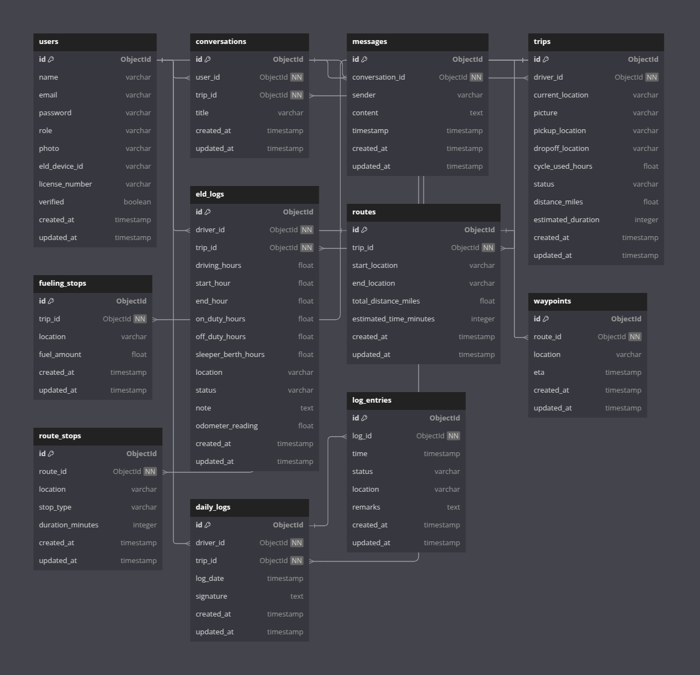

<div align="center">

# 🚛 ELD Flow 🛣️

[](https://www.rust-lang.org/)
[](https://www.rust-lang.org)
[](https://github.com/wiseaidev)
[](LICENSE)

[](https://discord.gg/b5JbvHW5nv)

| 🐧 Linux `(Recommended)` | 🪟 Windows |
| :------: | :------: |
| <video src="https://github.com/user-attachments/assets/1b333744-2ebf-4b15-a67b-d970dbbe0758"></video> | <video src="https://github.com/user-attachments/assets/1b333744-2ebf-4b15-a67b-d970dbbe0758"></video> |
| [**Download Executable**](https://github.com/opensass/eldflow/releases/download/v0.0.1/dist.zip) | [**Download Executable**](https://github.com/opensass/eldflow/releases/download/v0.0.1/dist.rar) |
| [**Set Environment Variables**](https://github.com/opensass/eldflow#-setting-up-env-vars) | [**Set Environment Variables**](https://github.com/opensass/eldflow#-setting-up-env-vars) |
| unzip files | unzip files |
| execute `./eldflow/server` | execute `.\eldflow\server.exe` |

> **Darn Easy ELD Log Management & Smart Trip Planning**

</div>

## 🚀 Overview

**ELD Flow** is a powerful, Rust-based application designed for commercial drivers to log their hours of service (HOS), track trips, and ensure compliance with ELD (Electronic Logging Device) regulations. It features AI-powered summaries, real-time syncing, and seamless trip tracking.

## 📊 Usage

1️⃣ **Sign Up/Login** - Create an account and log in as a driver.

2️⃣ **Start a Trip** - Log pickup and drop-off locations.

3️⃣ **Log Hours** - Automatically track driving, on-duty, and off-duty hours.

4️⃣ **Sync & Export** - View reports and export logs for compliance.

## ✨ Features

✔ **Easy ELD Logs** - Log, review, and manage hours effortlessly.

✔ **Smart Trip Tracking** - Plan, monitor, and optimize every route.

✔ **AI Insights** - Get automatic summaries and smart alerts.

✔ **Stay Compliant** - HOS tracking with real-time violation alerts.

✔ **Built for Devs** - High-performance Rust backend with fleet APIs.

✔ **GPS Route Optimization** - Smarter, faster navigation.

✔ **Advanced Analytics** - Actionable data at a glance.

## 📦 Installation & Setup

### 🖥️ For Pre-Compiled Binaries

Pre-compiled binaries are available for **Linux** and **Windows**. Download, set up environment variables, and run the application.

#### Windows

1. Download the latest `.exe` release.

1. Run:
   ```sh
   .\eldflow.exe
   ```

#### Linux

1. Download the latest binary.

1. Execute:
   ```sh
   chmod +x eldflow
   ./eldflow
   ```

### 🛠️ For Developers

1. Install [`rustup`](https://www.rust-lang.org/tools/install):

   ```bash
   curl --proto '=https' --tlsv1.2 -sSf https://sh.rustup.rs | sh
   ```

1. Install [`Dioxus CLI`](https://dioxuslabs.com/learn/0.5/getting_started):

   ```bash
   cargo install dioxus-cli@0.5.6
   ```

1. Fork/Clone the GitHub repository.

   ```bash
   git clone https://github.com/opensass/eldflow
   ```

## 🔑 Setting Up Env Vars

Before you can start running ELDFlow, you'll need to configure a few environment variables. These are essential for connecting to external services like MongoDB, Unsplash, and the Gemini AI, so let's get you set up! Here's a quick guide:

### Create an `.env` File

Inside the project root, copy and create a file named `.env` from `.env.example`. This file will securely store all your environment variables.

```bash
cp .env.example .env
```

> [!NOTE]
> Replace the following values with your actual credentials.
>
> ```bash
> MONGODB_USR=
> MONGODB_PWD=
> MONGODB_CLSTR=your-cluster.mongodb.net
> MONGODB_DB_NAME=elds
> JWT_SECRET=
> GEMINI_API_KEY=
> UNSPLASH_API_KEY=
> ```
>
> If you're missing any of these keys, check each service's developer portal to generate them.

### 🥑 Set Up MongoDB

Follow [our quick guide](./MongoDB.md) to set up your MongoDB database and connect it to your project!

### 🔐 Generate JWT Secret Key

Generate a secret key using OpenSSL and update its env var in the `.env` file.

```bash
openssl rand -hex 128

d8d0b35856c6fa90a8f3f818fa1c71785d63181945077a4c81e28f731de406c94acad5e864fc85604c520cd67e4977a06656eee081d2d0a897415bb42d8dca167662ae53078084ce70feaee104a3428797078c5bb359db277b26182114bb6b6f4e50d34dcce1ab2ed952912f5783ca89138d508f41bc2d56e60ef2480f501819
```

### ✨ Gemini AI API

To obtain your API key, navigate to [Google AI Studio](https://aistudio.google.com/app/apikey) and generate it there. This key allows ELDFlow to communicate with Gemini API.

### 📸 Unsplash API

ELDFlow uses Unsplash which provides a powerful API to search for and retrieve high-quality images. To communicate with this api you will need a [Secret key](https://unsplash.com/oauth/applications). If you don't already have one, sign up for a free account at Unsplash, create a new app, and copy the Secret key at the bottom of the page after creating the app.

## 🚀 Building and Running

Once the environment is set up, you're ready to build and run ELDFLOW.

### Build the Client

```sh
dx serve
```

Navigate to [http://localhost:3000](http://localhost:3000) to access ELDFLOW.

## 🛠️ Project Architecture

The system is designed with **modular Rust components**, ensuring high performance and scalability. The Axum backend integrates **MongoDB** for storing logs, trips, and user data.

### 📂 Database Schema



| Table         | Description |
|--------------|------------|
| `User`       | Stores driver details, license info, and ELD device IDs. |
| `Trip`       | Manages trip details, locations, and estimated durations. |
| `EldLog`     | Keeps track of driving, on-duty, and off-duty hours. |
| `Route`      | Stores trip routes, waypoints, and total distances. |
| `DailyLog`   | Logs daily activities, including driver signatures. |
| `FuelingStop` | Records fuel stops and locations. |
| `LogEntry`   | Tracks status changes like driving, resting, and on-duty shifts. |

## 🤝 Contributing

We welcome contributions! Feel free to submit **pull requests** or open **issues** for bug reports and feature suggestions.

## 📜 License

This project is licensed under the **MIT License**. See the [LICENSE](LICENSE) file for details.
